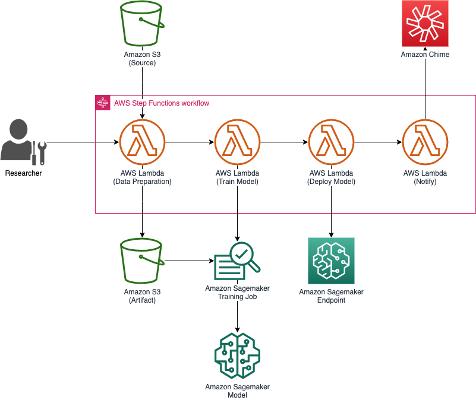

# Amazon Sagemaker Xgboost Pipeline

This repository is about build MLOps pipeline for Amazon Sagemaker built-in Xgboost regression model



# Prerequisites

- awscli
- Nodejs 12.x+
- Python 3.7+
- Docker
- AWS Account and Locally configured AWS credential

# Installation


Install project dependencies

```bash
$ cd infra
$ npm i
```

Install cdk in global context and run `cdk bootstrap` if you did not initailize cdk yet.

```bash
$ npm i -g cdk
$ cdk bootstrap
```

Deploy CDK Stacks on AWS

```bash
$ cdk deploy "*" --require-approval never
```

# Usage

deployment will displays state-machine-arn on the terminal,

*SagemakerXgboostDemoInfraStack.SagemakerStatesStatemachineArnDBA88BAA = arn:aws:states:ap-northeast-2:929831892372:stateMachine:StateMachine*

run statemachine with AWSCLI

```bash
$ aws stepfunctions start-execution --state-machine-arn arn:aws:states:ap-northeast-2:929831892372:stateMachine:StateMachine
{
    "executionArn": "arn:aws:states:ap-northeast-2:929831892372:execution:StateMachine:b1b23dd1-b2e6-40dd-b1b8-b07183505d9e",
    "startDate": 1617504354.973
}
```

visit [**AWS StepFunctions Console**]() page and check if the statemachine is working


# Cleanup

```bash
$ cdk destroy "*"
```